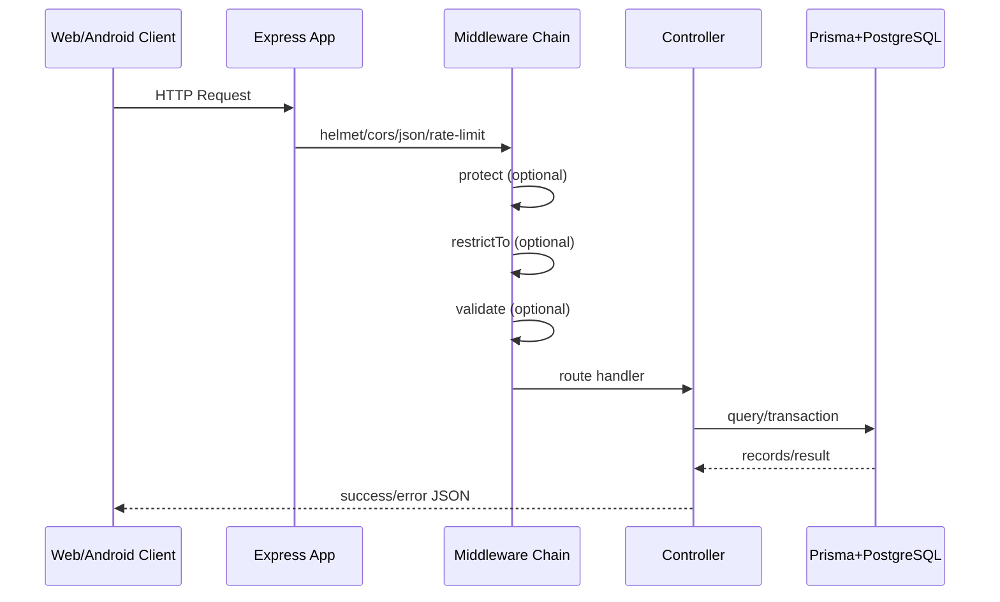

# Request Flow

## End-to-End Lifecycle

## Concrete Chain
1. `backend/server.js` starts app and DB connection.
2. `backend/src/app.js` applies security and parser middleware.
3. `backend/src/routes/index.js` dispatches by API domain.
4. Route-level middleware enforces auth/roles/validation.
5. Controller executes domain logic (`src/controllers/*`).
6. Response helper returns normalized payload (`src/utils/response.js`).
7. Errors bubble to `src/middleware/error.middleware.js`.

## High-Risk Request Paths
- Auth refresh rotation (`auth.controller.refresh`)
- Order creation stock decrements in transaction (`order.controller.create`)
- Product image upload flow (`upload.middleware` + `objectStorage`)
- Attendance uniqueness behavior (`Attendance @@unique([memberId, date])`)
