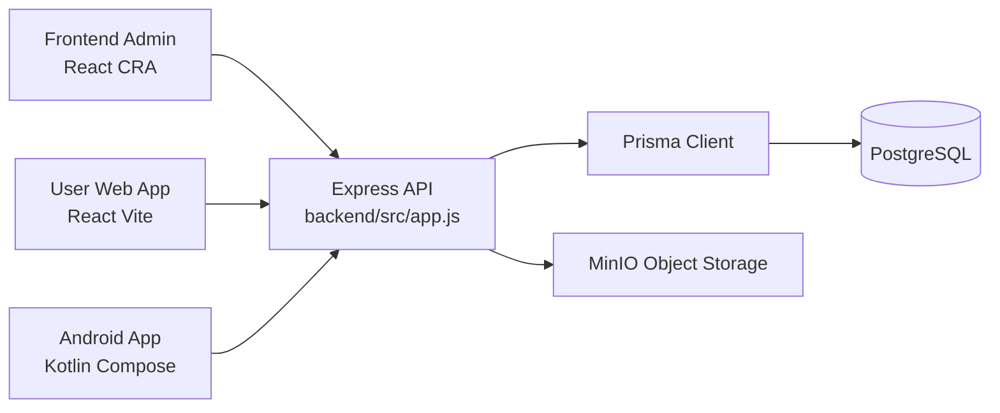

# System Overview

## Purpose
FytNodes is a multi-client gym management system with a shared backend and multiple frontends:
- `backend`: Node.js/Express REST API + Prisma/PostgreSQL
- `frontend`: web admin panel (React + CRA)
- `user-app`: web member app (React + Vite)
- `mobile/fytnodes_android`: native Android app (Kotlin/Compose), planned replacement by React Native

## Runtime Topology

## Core Architectural Decisions
- Single backend reused by all clients (`backend/server.js`, `backend/src/routes/index.js`)
- JWT access + refresh token lifecycle in backend (`backend/src/controllers/auth.controller.js`)
- Multi-tenant behavior by `gymId` and role constraints (`backend/src/middleware/rbac.middleware.js`)
- Android app uses modularized architecture (`mobile/fytnodes_android/settings.gradle.kts`)

## Integration Contract Boundaries
- Auth/session contract: `/api/auth/*`
- Profile bootstrap contract: `/api/auth/me`
- Attendance contract used by mobile: `/api/attendance/check-in`, `/api/attendance/:id/check-out`
- Product image contract: multipart upload + presigned URL responses (`backend/src/controllers/product.controller.js`, `backend/src/utils/objectStorage.js`)

## Constraints
- Backend currently carries production-critical business rules for roles, membership, subscriptions, attendance, stock, and orders.
- Android app contains additional client-side behavioral rules (validation, local cache semantics, navigation side effects) that must be preserved during RN migration.
