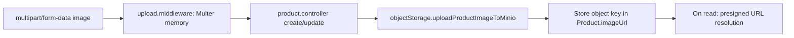

# Upload Flow

## Scope
Current upload flow is implemented for product images.

## Pipeline

## Files
- `backend/src/middleware/upload.middleware.js`
- `backend/src/controllers/product.controller.js`
- `backend/src/utils/objectStorage.js`

## Guardrails
- MIME restricted to JPEG/PNG/WEBP/GIF
- Max file size 5 MB
- Category-based folder prefixes in object storage

## Migration Notes
- RN app should use multipart upload to same endpoint contract.
- Backend currently stores object keys, not permanent public URLs.
