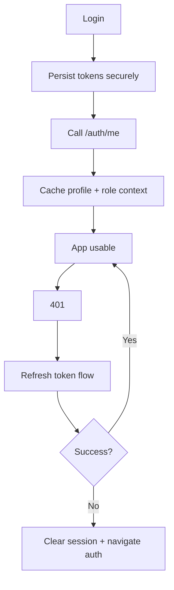

# Auth Strategy (RN)

## Session Model
- Access token in `expo-secure-store`
- Refresh token handling aligned with backend `/auth/refresh`
- Optional in-memory token mirror for performance

## Flow

## Preserve from Android
- Validation and user-visible error semantics.
- Post-login profile sync before role-sensitive actions.
- Logout should clear local caches and call backend revocation endpoints.
