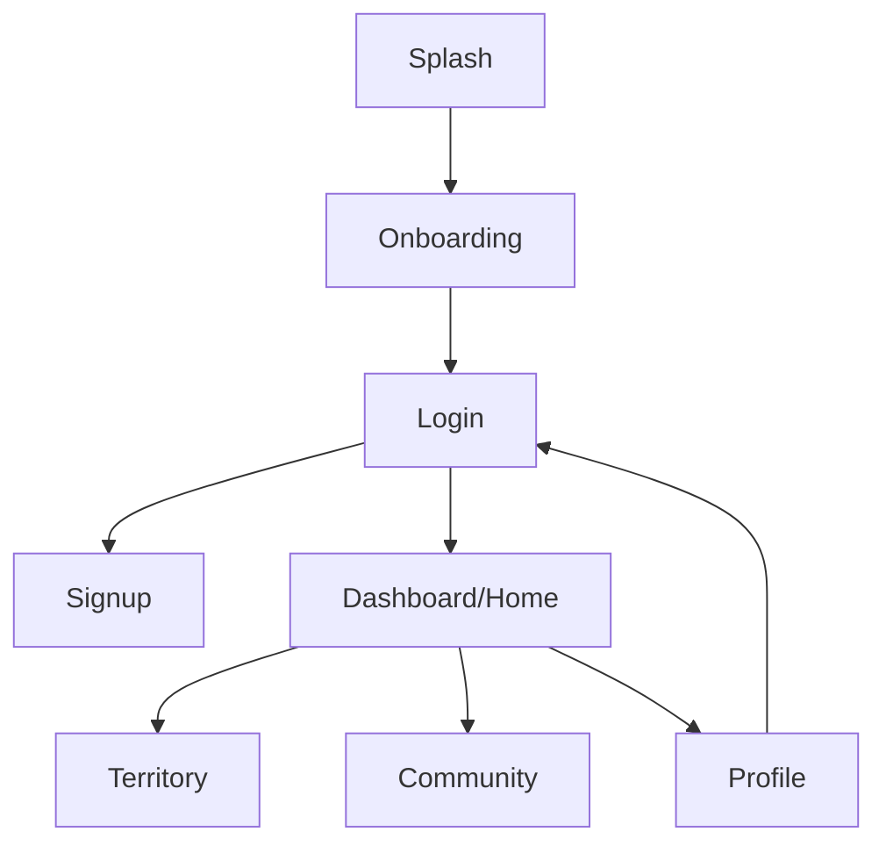

# Navigation Flow

## Route Graph

## Source of Truth
- `fan/navigation/AppNavHost.kt`
- feature route declarations:
  - `feature/splash/SplashNavigation.kt`
  - `feature/onboarding/.../OnboardingNavigation.kt`
  - `feature/login/LoginNavigation.kt`
  - `feature/signup/SignupNavigation.kt`
  - `feature/home/HomeNavigation.kt`
  - `feature/profile/presentation/ProfileScreen.kt`

## Behavior Notes
- Start destination is splash.
- Splash currently emits onboarding unconditionally (`SplashViewModel`).
- Bottom nav routes: `home`, `territory`, `community`, `profile`.
- Back from non-home tabs returns to home via `BackHandler`.
